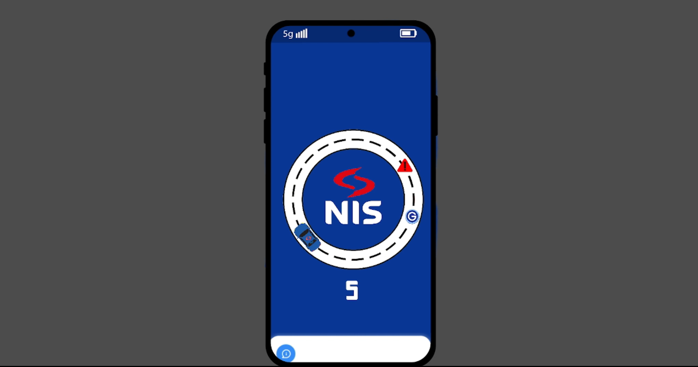

# Loyalty Game for Fuel Stations

This game was created for a hackathon in 2023 using the Godot engine. It is designed to support fuel stations' loyalty programs by providing an engaging experience where customers can play and collect loyalty rewards.

## Gameplay

- **Single-click control**: Players change the direction of their cars with a single click on the screen.
- **Goal**: Collect as many coins as possible while avoiding obstacles.
- **Obstacles**: Red triangles that players must avoid to keep playing.
- **Rewards**:
  - **Coins**: Collect as many coins as you can to increase your score.
  - **Loyalty Products**: Gather special in-game products to gain extra rewards.
  - **Special Abilities**: Power-ups are available that provide temporary boosts or abilities to help you stay in the game longer.

## Features

- Intuitive, single-click gameplay suitable for all audiences.
- Designed for fuel station loyalty programs to encourage customer engagement.
- Progressive difficulty that keeps players challenged.
- Integration of loyalty products and special abilities for added excitement.

## Hackathon Project

This game was developed as part of a hackathon in 2023, showcasing how gamification can be used in loyalty programs to drive customer engagement.

## How to Play

1. Tap or click anywhere on the screen to change the direction of your car.
2. Avoid red triangle obstacles while collecting coins.
3. Grab loyalty products and power-ups to enhance your gameplay and score.
4. Keep playing to achieve a high score!

## Screenshot

## Video Showcase

Watch the video showcase of the game on [YouTube](https://www.youtube.com/watch?v=1waDDXbefvQ).
